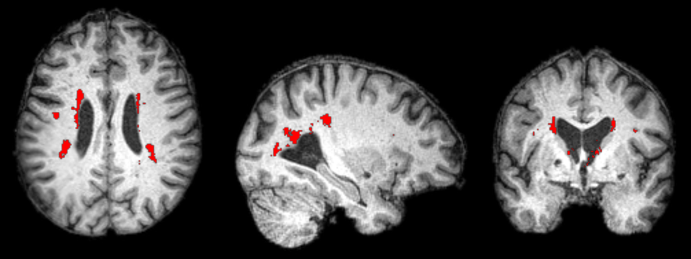

# fsl_bianca
These are lab notes and scripts for using [FSL's BIANCA](https://fsl.fmrib.ox.ac.uk/fsl/fslwiki/BIANCA) to estimate white matter hyper-intensities (WMHs) for a group of individuals who have had a stroke. WMHs are observed on MRI scans, and indicate that the white matter integrity may be compromised. While WMHs are seen in most older adults, the severity varies a lot between individuals. WMHs appear to be one measure of cognitive reserve, where people with healthier brains are more resilient to various forms of injury (traumatic brain injury, stroke, dementia). When humans rate WMHs using the Fazekas scale, we find that the severity of WMHs predict impairment and recovery. BIANCA is designed to automatically detect WMHs, providing an automated, objective method for investigating white matter hyper-intensities. However, BIANCA was not designed to work with people who have large strokes. This web page describes how BIANCA can be used for this population.

#### BIANCA Bugs

Currently (FSL 6.0.4, April 2021) [BIANCA](https://fsl.fmrib.ox.ac.uk/fsl/fslwiki/BIANCA/Userguide) is a `beta release`. The tool clearly warns users of the limitations:

```
BIANCA is currently considered to be in testing, meaning that you will need to inspect its output a bit more carefully to see if you are happy with it. The output will depend critically on the choice of options and the quality of the training data and manual segmentations. Further recommendations and automated tuning methods, will be supported in an upcoming release.
```

We have discovered two bugs that are hard to diagnose, but simple to fix. 

 - [BIANCA will fail if the masterfile begins with a Byte Order Mark](https://www.jiscmail.ac.uk/cgi-bin/wa-jisc.exe?A2=ind2103&L=FSL&O=D&X=2BE84B55F2EF684E35&Y=crorden6%40gmail.com&P=267610). The error message is not helpful. So it is wise to ensure your file does not have a BOM.
 - [BIANCA](https://www.jiscmail.ac.uk/cgi-bin/wa-jisc.exe?A2=FSL;18467c69.2104) will fail with large datasets with the error `cannot serialize a bytes object larger than 4 GiB`. This can be fixed by [saving data as 'protocol=4'](https://stackoverflow.com/questions/29704139/pickle-in-python3-doesnt-work-for-large-data-saving):

 ```
  pickle.dump(training_dat, open(GlobalOpts.save_classifier, 'wb'), protocol=4)
  pickle.dump(labelvals, open(GlobalOpts.save_classifier+"_labels", 'wb'), protocol=4)
```

#### BIANCA Tips

BIANCA has clear but minimal [documentation](https://fsl.fmrib.ox.ac.uk/fsl/fslwiki/BIANCA). One trick is to run BIANCA with the `-v` parameter. This verbose mode reports each step of BIANCA's processing. This will often help explain why BIANCA has behaved in an unexpected fashion. 

#### BIANCA In Two Passes

We will train BIANCA on images where a human has marked the WMHs, and subsequently have BIANCA identify WMHs a separate set of images where we have not drawn WMHs. In our case, BIANCA is trained on 55 people who are older, but have not suffered a stroke. We will then apply this classified to a large number of people who have had a stroke.

#### BIANCA Preprocessing

Here are the Matlab scripts for using BIANCA with lesion data:

 - A_getFLAIR.m : find all T1/T2/FLAIR/Lesion maps for stroke patients and provide consistent names.
 - B_enat.m : Use [Enantiomorphic normalization](https://www.ncbi.nlm.nih.gov/pmc/articles/PMC2658465/) to create 'healed' stroke images.
 - C_mask.m : Remove non-brain scalp tissue from images.
 - D_make_bianca_masterfile.m : Create BIANCA format masterfile for analyses.
 - E_norm.m : Normalize images from native space to standard space (this step could have been integrated with step B).

The image below shows an example of the results. The lesion is not visible on the healed T1 scan. The white matter hyperintensities are shown in red.
 


